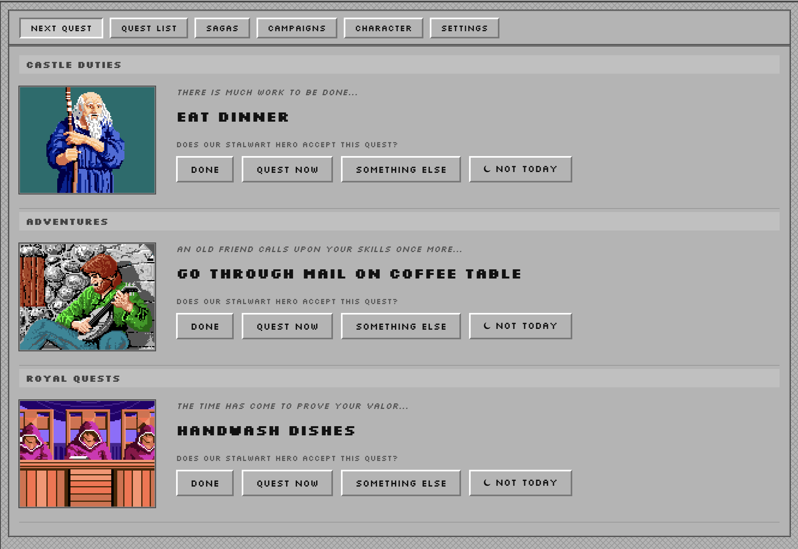

# Next Quest

An RPG-themed productivity app that gives you the right quest at the right time. You brain dump everything in, and it surfaces the best next thing to do.

Built for people who struggle with task initiation, routine maintenance, and the overwhelm of staring at a long to-do list.



## What Makes It Different

- **Brain dumping.** Easy interface with full keyboard support lets you get everything out of your head and into the app fast. Or use the [CLI](docs/cli-guide.md) to pipe in quests from external tools.
- **Smart surfacing.** Multi-factor algorithm surfaces tasks as quests by weighing time past due, importance, time of day, list position, user responses, and more.
- **Only Three Things.** Routine tasks, side quests, and bigger undertakings are each offered one at a time by their own quest giver.
- **Encounters.** Timed overlay interrupts hyperfocus with tasks from across all three quest givers.
- **No punishment.** No decay, no streaks. Miss a day? Quests resurface naturally. XP is derived from your completion history.
- **RPG progression.** XP flows to your character, reflecting your actual attainments in personal values (attributes) and directional goals (skills).
- **Sagas.** Multi-step goals revealed one step at a time.
- **Campaigns.** Define achievements that are meaningful to you, track progress across quests and sagas, and commemorate accomplishments on your character.

For more detail, see the [Mechanics reference](docs/mechanics.md).

### What's New in v1.0.0

- **XP derived from history.** Character, attribute, and skill XP are now computed from completion records — no more cached running totals.
- **Richer completion history.** Each entry shows difficulty, cycle, linked skills/attributes (in color), tags, and saga badges.

See the [release notes](https://github.com/suzbot/next-quest/releases/tag/v1.0.0) for details.

### Keyboard Shortcuts

**Quest List tab:**

| Key | Action |
|-----|--------|
| N | Open the add quest form (focus lands in title field) |
| Escape | Close the add quest form |
| E | Edit the focused quest |
| Enter | Complete the focused quest |
| Delete / Backspace | Delete the focused quest |
| Arrow Up / Down | Navigate between quests |
| Alt + Arrow Up / Down | Reorder the focused quest |
| Tab | Move between form fields when adding/editing |

**Encounters overlay:**

| Key | Action |
|-----|--------|
| F | Fight (start timer) |
| C | Cast Completion (complete immediately) |
| R | Run (skip) |
| H | Hide in the Shadows (dismiss) |

## How It Was Built

Next Quest is built through an iterative collaboration between a Product Manager and [Claude Code](https://claude.com/claude-code), using custom skills to coordinate the workflow. Each feature follows a structured process:

1. **[Requirements](docs/requirements/)** — Talk through what to build, surface edge cases, explore trade-off, capture what and why in a document
2. **[Tech Design](docs/design/)** — Confer and capture the technical approach and implementation steps
3. **[Cyclical implementation and testing](.claude/skills/)** — Code to the spec, with tests, run the app, provide feedback
4. **[Vision and roadmap](VISION.md)** - Updated based on the feedback loop

The collaboration is shaped by [`CLAUDE.md`](CLAUDE.md), which defines the working relationship, communication style, process guardrails, and design principles.

## Install

Pre-built macOS binaries are available on the [Releases page](https://github.com/suzbot/next-quest/releases).

## Build from Source

**Prerequisites:**
- [Rust](https://www.rust-lang.org/tools/install) (stable)
- [Tauri 2 CLI](https://tauri.app/start/)
- macOS: Xcode Command Line Tools (`xcode-select --install`)

```bash
# Build (debug)
cargo tauri build --debug

# Run
./target/debug/next-quest

# Run tests
cargo test
```

### CLI

A command-line tool (`nq`) for creating quests and querying data without opening the app. Shares the same database and business logic as the GUI.

```bash
# Build
cargo build -p nq

# Examples
./target/debug/nq list-quests --due --day today
./target/debug/nq list-history
./target/debug/nq add-quest --title "Read a book" --difficulty easy --type one_off
echo '[{"title":"Q1","difficulty":"easy","quest_type":"one_off"}]' | ./target/debug/nq add-batch
```

See the full [CLI Guide](docs/cli-guide.md) for all commands and options.

### First Launch (macOS)

The app isn't code-signed, so macOS will show a warning that says "Apple could not verify 'Next Quest' is free of malware." If you still want to run it, right-click the app → Open → click Open in the dialog. You only need to do this once — after that it launches normally.

## Customization

Images and flavor text are loaded from external directories — no code changes needed to personalize the app.

**Images:** Drop `.gif` files into the folders under `ui/images/`. Each subfolder serves a different context: `quest-givers/`, `monsters/`, `victory/`, `defeat/`, and per-lane folders (`lane1/`, `lane2/`, `lane3/`). Rebuild to regenerate the image manifest.

**Flavor text:** Edit the `.txt` files under `ui/text/`. One line per entry — the app picks randomly. Per-lane folders hold quest giver dialog, and top-level files cover encounter lines and general quest giver lines.

## Architecture

Cargo workspace with three crates:

- **nq-core** — shared library with data logic, business rules, and SQLite access. Used by both the GUI and CLI.
- **src-tauri** — Tauri GUI app. Window management, system tray, timers, notifications, web frontend in `ui/`.
- **src-cli** — CLI tool (`nq`). Creates quests, queries data. JSON output for programmatic use.

## License

[GPL-3.0](LICENSE)
